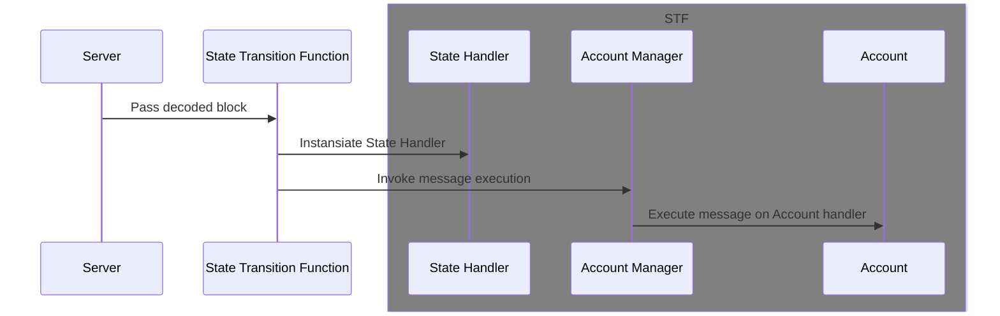

# Executor

The executor is the state transition function. The state transition function is responsible for executing a transaction and updating the state. It is not responsible for writing the state to disk or performing any other side effects.

## State Transition Function

The state transition function is responsible for executing a transaction and updating the state. It is responsible for transaction verification, execution, querying, simulation and state updates.

