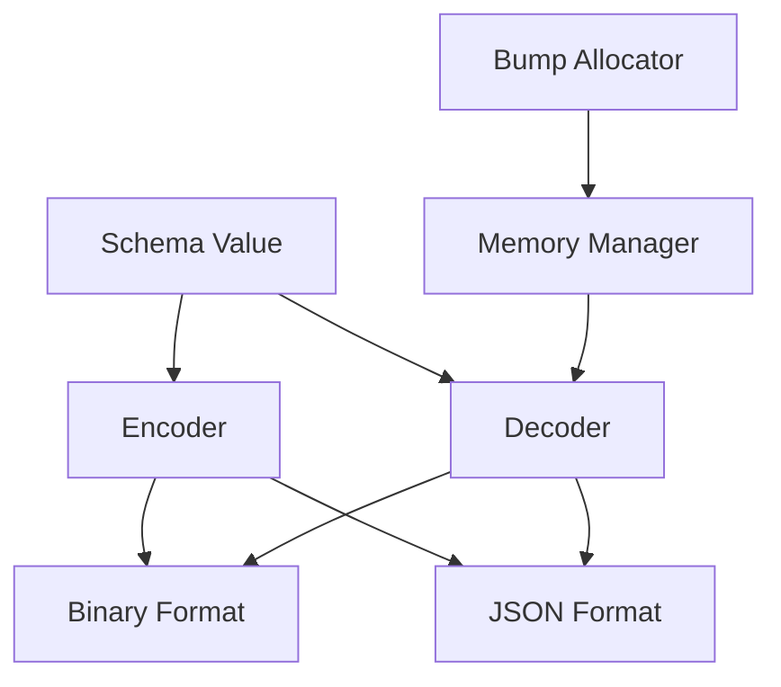
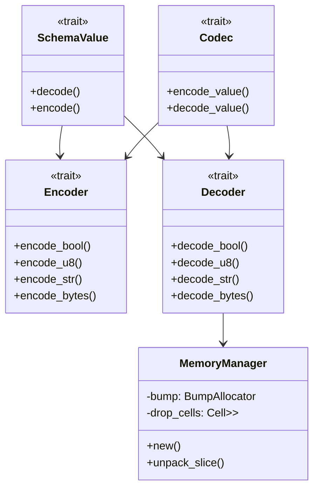
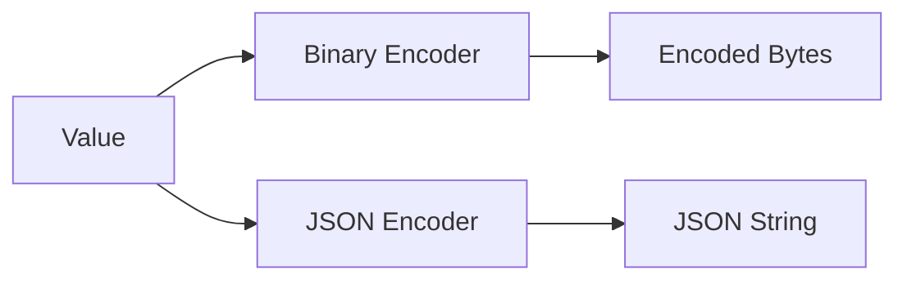
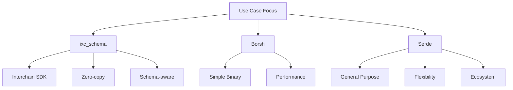

# Why ixc_schema?

## 1. High-Level Overview

The `ixc_schema` crate is a specialized serialization framework designed for the Interchain SDK. Here's a high-level diagram:



Key differences from Borsh and Serde:

1. **Memory Management**:
   - Serde: Relies on standard allocator
   - Borsh: Relies on standard allocator
   - ixc_schema: Custom bump allocator for efficient memory management

2. **Design Philosophy**:
   - Serde: Generic serialization framework
   - Borsh: Binary-focused, simple serialization
   - ixc_schema: Specialized for Interchain SDK with schema awareness

## 2. Core Components

Here's a more detailed look at the architecture:



## 3. Key Features

### 3.1 Memory Management

```rust
pub struct MemoryManager {
    bump: crate::bump::BumpAllocator,
    drop_cells: Cell<Option<NonNull<DropCell>>>,
}
```

The custom memory management system is one of the most distinctive features. It uses a bump allocator for efficient allocation and proper cleanup.

### 3.2 Encoding Support



The crate supports multiple encoding formats with a unified interface.

## 4. Comparison with Borsh and Serde

### 4.1 Feature Comparison

| Feature | ixc_schema | Borsh | Serde |
|---------|------------|-------|-------|
| Memory Management | Custom bump allocator | Standard allocator | Standard allocator |
| Zero-copy Deserialization | Yes | No | Limited |
| Schema Support | Built-in | No | Via attributes |
| Format Support | Binary + JSON | Binary only | Many formats |
| Customization | SDK-specific | Limited | Highly extensible |

### 4.2 Use Case Focus



## 5. Key Advantages

1. **Zero-Copy Deserialization**:

    ```rust
    fn decode_borrowed_str(&mut self) -> Result<&'a str, DecodeError> {
        let s = self.value.as_str().ok_or(DecodeError::InvalidData)?;
        unsafe { copy_str(self.mem, s).map_err(|_| DecodeError::InvalidData) }
    }
    ```

2. **Efficient Memory Usage**:

    ```rust
    pub struct BumpAllocator<A: Allocator = Global> {
        cur: Cell<Option<NonNull<Footer>>>,
        base_allocator: A,
    }
    ```

3. **Schema-Aware Design**:

    ```rust
    pub struct HandlerSchema<'a> {
        pub types: List<'a, SchemaType<'a>>,
        pub messages: List<'a, MessageDescriptor<'a>>,
        pub state_objects: List<'a, StateObjectDescriptor<'a>>,
        pub clients: List<'a, ClientDescriptor<'a>>,
    }
    ```

The crate is more specialized than Borsh or Serde, focusing on:

- Efficient memory management
- Zero-copy deserialization where possible
- Schema-aware serialization
- Interchain SDK integration

This makes it less general-purpose than Serde but potentially more efficient for its specific use case in the Interchain SDK.
