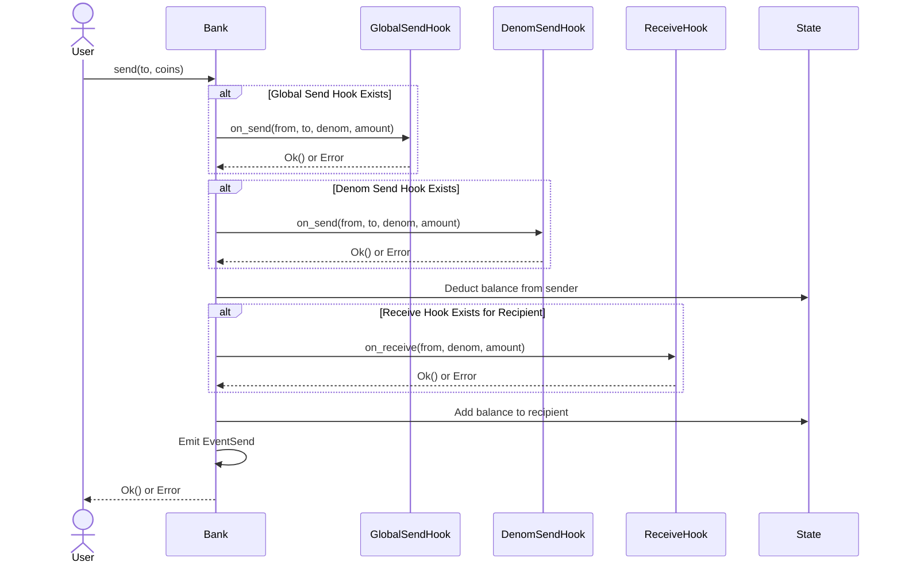
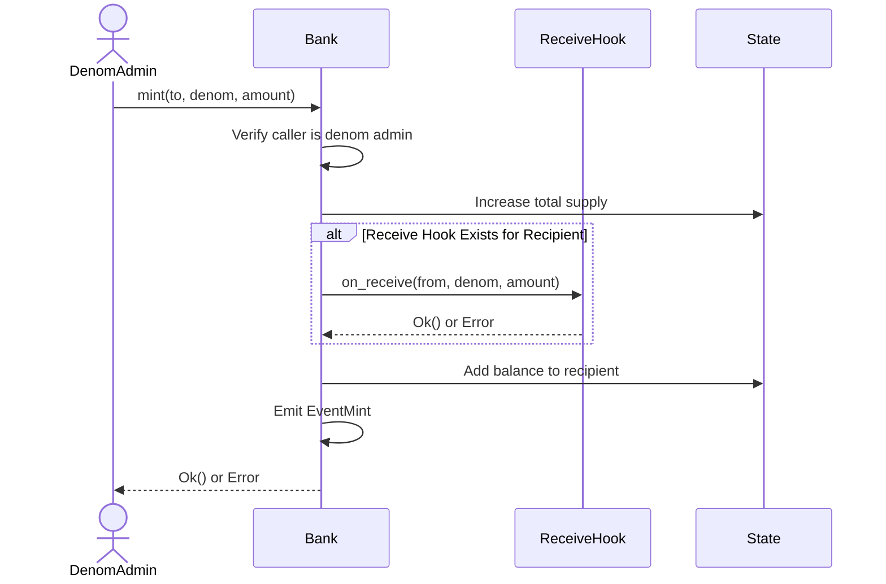
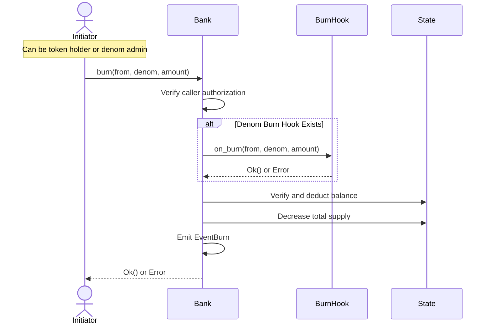

# Bank Module

The Bank module provides token management functionality within the blockchain, allowing for token transfers, minting, and burning operations. It includes a robust hook system for custom logic execution during various token operations.

## Core Features

- Token transfers between accounts
- Token minting by authorized admins
- Token burning by token holders or admins
- Balance queries
- Customizable hooks for send, receive, and burn operations
- Denom-specific administration

## State Management

The module maintains several key state components:

- **Balances**: Tracks token balances for each account per denomination
- **Supply**: Tracks total supply for each token denomination
- **Super Admin**: Single account with system-wide administrative privileges
- **Global Send Hook**: Optional hook triggered for all send operations
- **Denom-specific state**:
  - Denom Admins: Administrators for specific denominations
  - Denom Send Hooks: Custom hooks for specific token sends
  - Denom Burn Hooks: Custom hooks for specific token burns
  - Denom Receive Hooks: Custom hooks for specific accounts receiving tokens

## Messages (Transactions)

### Administrative Operations

1. **Create Denom**
   ```rust
   create_denom(denom: &str, admin: AccountID)
   ```
   - Creates a new token denomination
   - Only callable by super admin
   - Sets the specified account as the denom admin

2. **Set Global Send Hook**
   ```rust
   set_global_send_hook(hook: AccountID)
   ```
   - Sets a global hook for all send operations
   - Only callable by super admin

3. **Set Denom-specific Hooks**
   ```rust
   set_denom_send_hook(denom: &str, hook: AccountID)
   set_denom_burn_hook(denom: &str, hook: AccountID)
   set_denom_recieve_hook(hook: AccountID)
   ```
   - Sets hooks for specific denominations or accounts
   - Denom hooks require denom admin authorization
   - Receive hooks can be set by any account for themselves


### Token Operations

#### Send Operation

The send operation transfers tokens from one account to another, with multiple hooks that can intercept and validate the transfer.

   ```rust
   send(to: AccountID, amount: &[Coin])
   ```

**State Changes:**
- Decreases sender's balance
- Increases recipient's balance
- No change to total supply

**Event Emitted:**
- `EventSend`: Contains sender (`from`), recipient (`to`), and coin details (denom and amount)

**Hook Execution Order:**
1. Global Send Hook (if set)
2. Denom Send Hook (if set)
3. Receive Hook (if set for recipient)



#### Mint Operation

The mint operation creates new tokens, increasing both the recipient's balance and the total supply. Only the denom admin can mint tokens.

  ```rust
   mint(to: AccountID, denom: &str, amount: u128)
   ```

**State Changes:**
- Increases recipient's balance
- Increases total supply for the denom
- No change to other accounts

**Event Emitted:**
- `EventMint`: Contains recipient (`to`) and coin details (denom and amount)



#### Burn Operation

The burn operation destroys tokens, reducing both the holder's balance and the total supply. Can be initiated by either the token holder or the denom admin.

  ```rust
   burn(from: AccountID, denom: &str, amount: u128)
   ```

**State Changes:**
- Decreases holder's balance
- Decreases total supply for the denom
- No change to other accounts

**Event Emitted:**
- `EventBurn`: Contains token holder (`from`) and coin details (denom and amount)



Each operation ensures atomicity - either all state changes occur successfully, or none do. If any hook returns an error or if any state change fails, the entire operation is reverted.

## Queries

1. **Get Balance**
   ```rust
   get_balance(account: AccountID, denom: &str) -> u128
   ```
   - Returns the token balance for a specific account and denomination


## Hook System

The module supports three types of hooks:

1. **SendHook**: Triggered before token transfers
   - Called for both global and denom-specific hooks
   - Can prevent transfer by returning an error

2. **BurnHook**: Triggered before token burning
   - Called for denom-specific burn operations
   - Can prevent burn by returning an error

3. **ReceiveHook**: Triggered when an account receives tokens
   - Called for specific accounts that have registered receive hooks
   - Can prevent receive by returning an error

## Security

- Operations are protected by appropriate authorization checks
- Denom administration is controlled by designated admin accounts
- Balance modifications use safe arithmetic operations
- Hook system allows for custom security logic implementation

## Testing

The module includes comprehensive tests covering:
- Basic token operations
- Hook functionality
- Authorization checks
- Multi-account scenarios
- Error cases

For specific implementation details and usage examples, refer to the test cases in the source code.
