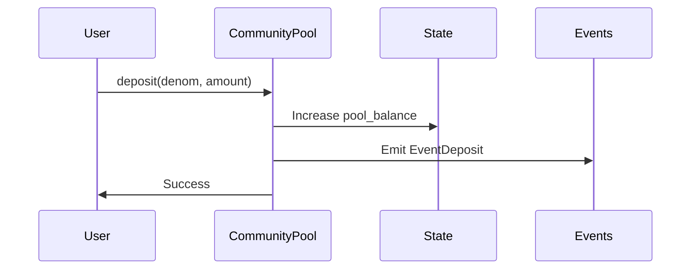
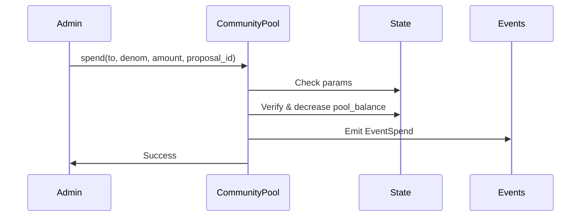

# Community Pool Module

The Community Pool module enables users to deposit tokens into a shared pool and allows authorized administrators to spend these tokens. This module is designed to manage communal funds with proper governance controls and transparency.

## Overview

The Community Pool maintains balances for different token denominations and enforces spending rules through configurable parameters. All spending operations must meet minimum amount requirements and can only be executed when spending is enabled.

## State

The module maintains the following state:

- **PoolBalance**: An accumulator map tracking token balances per denomination
- **Params**: Configuration parameters including:
  - `spend_enabled`: Boolean flag controlling spending capability
- **Admin**: Account ID of the authorized administrator

## Operations

### Deposit

Adds tokens to the community pool.

**State Modified:**
- `pool_balance`: Increases the balance for the specified denomination

**Events Emitted:**
- `EventDeposit`:
  - `from`: Account ID of the depositor
  - `coin`: Details of deposited tokens (denom and amount)

### Spend

Transfers tokens from the community pool to a specified account.

**State Modified:**
- `pool_balance`: Decreases the balance for the specified denomination

**Requirements:**
- Caller must be the admin
- `spend_enabled` must be true
- Amount must be ≥ `min_proposal_amount`
- Pool must have sufficient balance

**Events Emitted:**
- `EventSpend`:
  - `to`: Recipient account ID
  - `coin`: Details of spent tokens (denom and amount)
  - `proposal_id`: Associated proposal identifier

### Set Parameters

Updates the module's configuration parameters.

**State Modified:**
- `params`: Updates spending configuration

**Requirements:**
- Caller must be the admin

## Queries

### Get Balance

Retrieves the current balance for a specific token denomination.

**Returns:**
- `u128`: Current balance amount

**State Accessed:**
- `pool_balance`: Reads the balance for the specified denomination

## Initialization

During creation, the module:
1. Sets default parameters:
   - `spend_enabled = true`
2. Sets the creator as the admin

## Development

### Testing

The module includes basic tests that verify:
- Deposit functionality
- Spending restrictions
- Admin authorization
- Balance tracking

