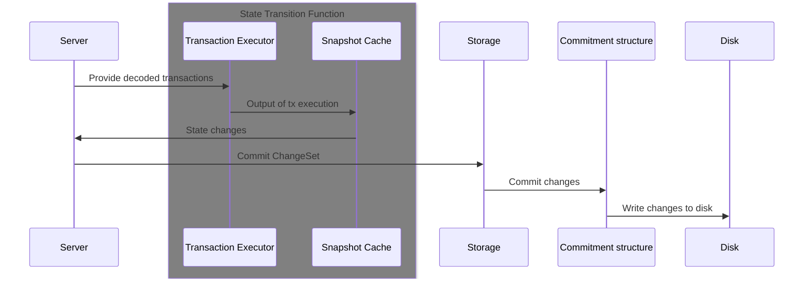
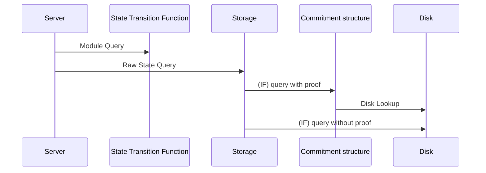

# IXC Storage

Storage abstracts the underlying storage mechanism for the framework. It handles caching and grouping of state changes before committing them to the underlying storage.

## Commit Flow

## Query FLow

## Query Flow

## State Changes

State changes are the atomic units of state updates. They are grouped together and committed in a single transaction.

## Snapshots

Snapshots are a way to revert the state to a previous state. They are used to implement the `revert_to` method on the `StateObject` trait.

## Caches

Caches are used to store state changes and snapshots. They are used to implement the `revert_to` method on the `StateObject` trait.
