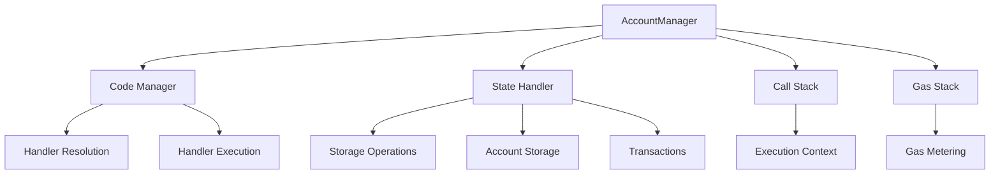
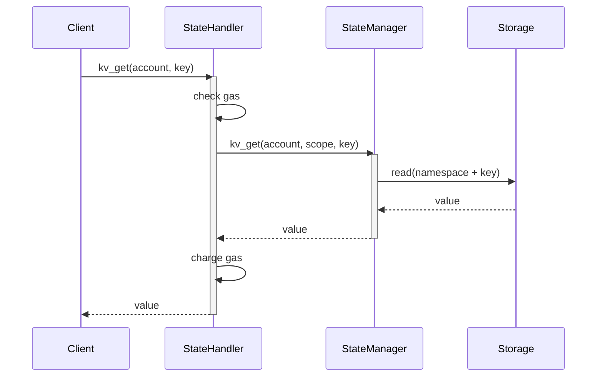
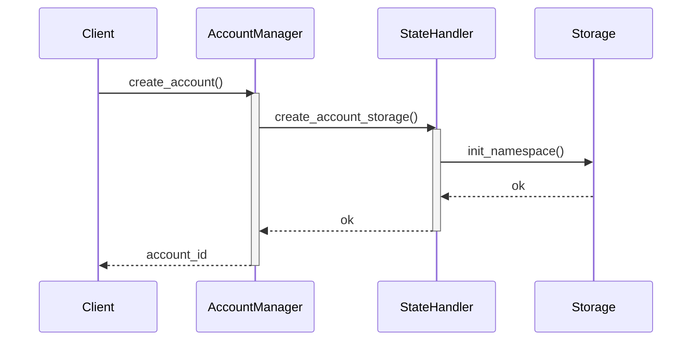
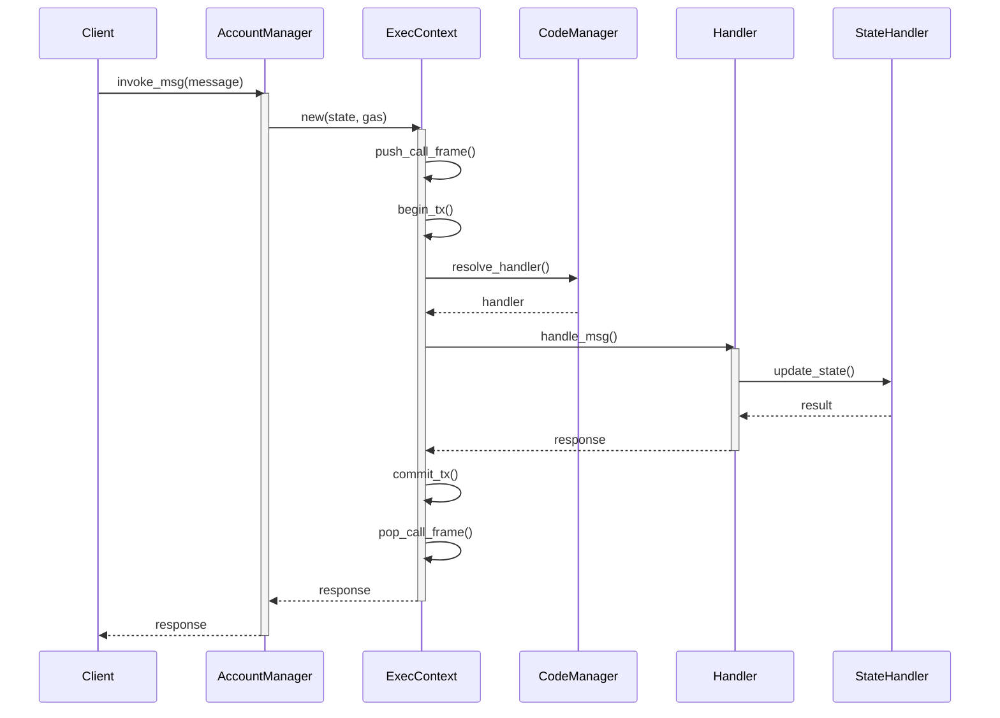
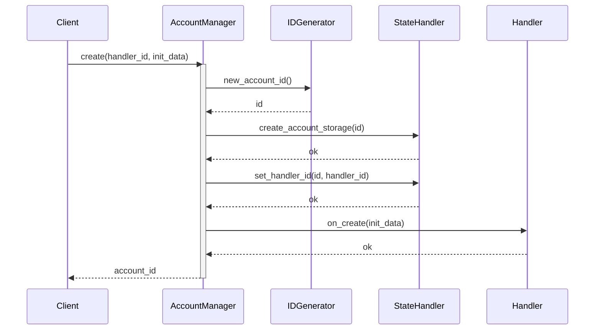
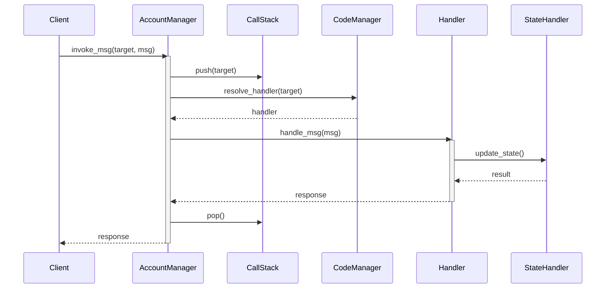
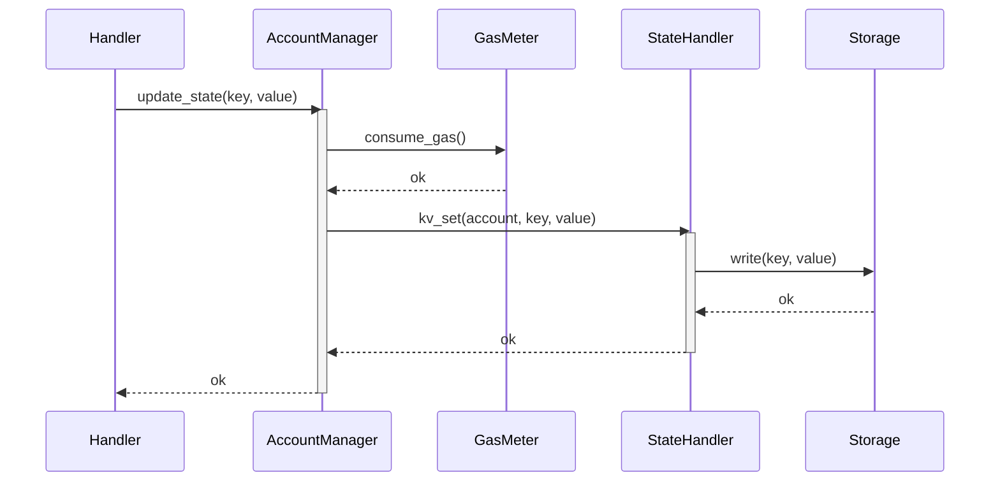

# Account Manager Overview

The Account Manager is a core component responsible for managing account lifecycle, message execution, and state management in the VM system. It provides:

1. Account creation and destruction
2. Message execution and routing
3. Gas metering and limits
4. State management and storage access
5. Call stack management

## Key Components

### AccountManager

The main struct that coordinates all account-related operations. It holds:

- Code Manager (VM) - Resolves and executes handlers
- Call Stack - Tracks execution context
- Gas Stack - Manages gas consumption
- State Handler - Manages state access

### Execution Context

Manages the execution of messages including:

- Message routing
- Gas metering
- State transactions
- Call stack management

### State Handler

Provides an interface for:

- Key-value storage operations
- Account storage management  
- Transaction management
- Event emission

## Architecture

# Storage Architecture

The Account Manager uses a layered storage architecture to manage state.

## Storage Layers

1. **State Handler Interface**
   - Defines core storage operations
   - Manages transactions
   - Handles account storage lifecycle

2. **Standard State Handler**
   - Implements state handler interface
   - Adds gas metering
   - Provides standard KV operations

3. **State Manager**
   - Backend storage implementation
   - Handles raw storage operations
   - Manages account namespacing

## Storage Operations

### Key-Value Operations

### Account Storage Management

# Message Execution

The Account Manager handles message execution through a series of coordinated steps.

## Message Flow

## Key Steps

1. **Message Receipt**
   - Validate message format
   - Check target account exists
   - Initialize execution context

2. **Handler Resolution**
   - Look up account's handler ID
   - Resolve handler through VM
   - Prepare handler context

3. **Execution**
   - Push call frame
   - Begin transaction
   - Execute handler
   - Handle response/errors
   - Commit/rollback transaction
   - Pop call frame

4. **State Management**
   - Track gas usage
   - Manage state access
   - Handle storage operations
   - Emit events

# Step-by-Step Walkthrough

This guide walks through the key operations in the Account Manager.

## Account Creation

1. Client sends create message to root account
2. Account Manager:
   - Generates new account ID
   - Initializes account storage
   - Sets handler ID
   - Calls handler's on_create

## Message Execution

1. Client sends message to account
2. Account Manager:
   - Pushes call frame
   - Resolves handler
   - Executes message
   - Manages state access
   - Returns response

## State Access

1. Handler requests state access
2. Account Manager:
   - Validates permissions
   - Meters gas
   - Performs operation
   - Returns result

This documentation provides a comprehensive overview of the Account Manager's functionality, architecture and key workflows. Let me know if you would like me to expand on any particular area or add additional diagrams.
